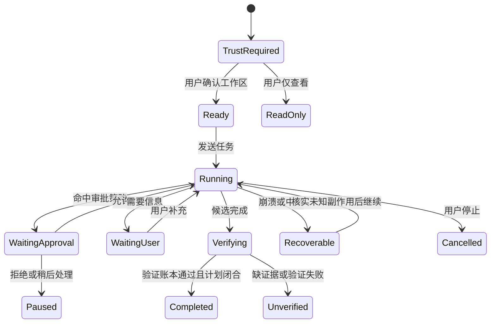

# Xiu v0.20.2 设计：本地优先的桌面工作台

0.20.2 MCP 第一阶段采用共享 Manager 组合和无 Electron 依赖的 WorkspaceMcpService。桌面主进程在可信工作区内显式连接已有配置，将 MCP 工具注册到真实 Agent，不仅是设置展示；权限库与 CLI 相同，预览指纹必须匹配确认时配置。读取面板不启动程序，重载失败移除旧工具，配置/任务单写者互斥，工作区切换等待旧连接清理后才创建新 host，退出清理 stdio/HTTP。桌面新增/编辑、OAuth 登录与 Resource/Prompt 管理保留为后续缺口；不添加默认 MCP，不公开原始配置或秘密，不绕过风险审批和 Plan 只读。

> 0.20.2 未发布修复：CLI/桌面共用零渠道首次配置；供应商仅作为显式添加模板。版本 5 注册表一次性迁移旧设置中被明确引用的预设，保留凭据引用、模型选择和路由，不根据环境变量自动注册。两端支持空配置启动与删除最后一个渠道，缺少渠道时阻止任务执行；不实现企业预设或账户/积分分发，不扩大工具权限。

> 状态：G1-G5C 已完成本机实现、Windows x64 候选包验收与三平台自动化 CI，下一步进入外部设备矩阵。本文是仓库根目录唯一的当前版本设计稿；v0.19.0 的实现与验收历史保存在 Git、`CHANGELOG.md` 和 `PUBLISHING.zh-CN.md` 中。

## 1. 目标

v0.20.1 延续 Xiu 第一版桌面工作台，并纳入 0.20.0 发布后的能力模型选择、媒体下载边界与 Windows 后台进程交接修正，让用户在不依赖终端滚动历史的情况下完成以下闭环：

1. 打开并信任本地工作区。
2. 新建、继续、停止和恢复任务。
3. 看见模型回复、工具活动、计划进度和后台状态。
4. 在风险操作前理解并作出审批决定。
5. 复查文件变化、原文件和验证证据。
6. 只有程序门禁满足时才显示“已完成”。

桌面端不是新的 Agent，也不是完整 IDE。它是现有 Xiu 执行内核的图形界面，CLI 继续作为完整、可独立使用的产品入口。

## 2. 参考与取舍

### 2.1 吸收的模式

- Codex：项目与任务分层、中心任务流、可折叠右侧审查面板、模型与权限入口、运行中可继续引导。
- Qoder：清晰的工作区树、审查与文件预览并列、浅色主题的信息密度、源代码与渲染预览切换。

### 2.2 Xiu 的差异化

- 完成状态来自验证账本和任务状态，不由模型文案决定。
- 审批展示具体动作、目标、风险、权限范围和后果，而不是一个泛化的“允许”。
- 工作区信任、Plan 只读、检查点和崩溃恢复是一等界面状态。
- Provider、MCP、Skill 和插件保持中立；首版不绑定单一模型或云账户。
- “工具调用很多”不是主要信息。默认显示可扫描摘要，完整参数和输出按需展开。

## 3. 产品范围

### 3.1 MVP 必须交付

| 能力 | 最小闭环 |
| --- | --- |
| 工作区 | 选择目录、信任确认、最近项目、锁状态 |
| 任务 | 新建、恢复、停止、继续引导、查看历史 |
| 对话 | 流式回复、工具摘要、计划进度、后台活动 |
| 输入 | 文本、文件/图片引用、Slash 命令、发送/停止 |
| 模式 | Auto 与 Plan；Plan 模式在程序层保持只读 |
| 审批 | 风险说明、目标范围、一次允许/拒绝；危险动作额外确认 |
| 审查 | 文件列表、Diff、原文件、Markdown/安全 HTML 预览 |
| 证据 | 验证项、失败项、检查点、任务终态和恢复建议 |
| 设置 | 语言、主题、Provider 与对话/视觉/生图/视频/音频模型选择、连接测试、诊断入口 |

### 3.2 首版明确不做

- 不做云同步、账号体系、分享、Pull Request 和远程任务。
- 不做完整代码编辑器、调试器或插件商店。
- 不做任意网页浏览器，也不在预览中执行不可信脚本。
- “终端”页承载 G5B 交互式 PTY；Agent 已执行命令的有界、脱敏证据移动到“证据”页，两类输出保持明确分离。
- 不改变凭证后端、自动更新、MCP/Skill 权限或危险操作规则。
- 不把桌面依赖塞入 `@xiu-ai/cli` 的 npm 包；桌面安装物独立构建和发布。

## 4. 信息架构

桌面窗口采用可调整的三栏结构：

```text
┌──────────────┬──────────────────────────────┬──────────────────────┐
│ 项目与任务    │ 当前任务                      │ 检查器                │
│              │                              │                      │
│ 新建任务      │ 标题 / 工作区 / 运行状态       │ 变更  文件  命令  证据 │
│ 最近项目      │ 对话与工具事件流               │ Diff / 预览 / 详情     │
│ 任务历史      │                              │                      │
│              │ 计划与运行进度                 │                      │
│ 设置 / 帮助   │ 输入框 / 模式 / 权限 / 模型     │                      │
└──────────────┴──────────────────────────────┴──────────────────────┘
```

- 左栏默认 248px：项目、任务和全局入口；不展示无关的“功能大厅”。
- 中栏最小 520px：任务事实流与主要操作区。
- 右栏默认 440px，可收起、拖动宽度；发生文件修改后自动提示但不强制抢焦点。
- 窄窗口下左栏变抽屉，右栏变覆盖面板；输入和审批不能被隐藏。

### 4.1 左栏：项目与任务

- “新建任务”是唯一高强调入口。
- 项目按最近使用排序，每个项目下显示运行中、等待审批、已完成和可恢复任务。
- 状态同时使用图标与文本，不只依靠颜色。
- 同一工作区已有 CLI 或 GUI 活跃写入锁时，明确显示所有者并限制为只读打开或等待。

### 4.2 中栏：任务流

任务流只保留七类稳定事件：用户输入、助手答复、工具活动、计划更新、审批、变更摘要、验证终态。

- 普通工具事件默认一行摘要，可展开完整有界输出。
- 计划以“完成数、当前、下一步”固定在输入框上方，完整计划在检查器中查看。
- 用户可在运行中补充信息；补充进入已记录的 steering 队列，不伪装成新任务。
- 完成卡片显示耗时、模型轮次、工具次数、变更、验证和未解决风险。

### 4.3 输入区

- 上层是可多行输入框，支持 `@` 引用文件/图片和 `/` 命令。
- 下层依次为附件、权限策略、Provider/模型、发送或停止；Provider/模型占用剩余宽度并保留完整名称提示，不使用固定百分比裁掉模型标识。
- 权限策略提供“每次询问、工作区自动、高权限”三个明确模式。工作区自动仅覆盖工作区文件编辑与项目验证；高权限仅自动批准非危险操作；危险操作、工作区信任与路径边界始终由核心强制检查。
- 运行中发送按钮切换为停止；停止后可继续，而不是自动创建新会话。

### 4.4 右侧检查器

| 页签 | 内容 |
| --- | --- |
| 变更 | 当前工作区全部 Git/文件变化、Last turn 过滤、逐文件 Diff、检查点恢复入口 |
| 文件 | 工作区树、文本/图片/Markdown/安全 HTML 预览、源代码与预览切换 |
| 命令 | Xiu 发起的命令、退出码、耗时和有界输出；它是审计证据，不是交互 Shell |
| 证据 | 计划、验证账本、失败原因、检查点、任务运行记录和恢复动作 |

## 5. 核心状态机



界面中的绿色“已完成”必须同时满足：Agent 终态为 `completed`、验证账本无阻塞失败、计划无未完成步骤、没有结果未知且待核实的副作用。其他情况分别显示“等待审批”“需要输入”“未验证”“可恢复”“已停止”或“失败”。

## 6. 审批设计

审批使用阻断式浮层，但保留任务上下文。每次审批必须展示：

- 动作与发起工具；
- 影响目标，路径按工作区相对路径显示；
- 风险级别与触发规则；
- 是否涉及写文件、执行进程、网络写入、凭证或工作区外访问；
- 现有检查点与可恢复性；
- “拒绝并补充要求”和“仅本次允许”。

审批卡仍可针对核心给出的精确非危险范围选择“本次会话始终允许”。输入区权限菜单提供进程级的逐次询问、工作区自动和非危险高权限模式；切换只由主进程接受，任务运行中禁止切换，退出应用后回到逐次询问。删除、覆盖、回退、发布和凭证清理继续使用额外的精确确认。模型文本不能改变审批结果。

## 7. CLI 与 GUI 共存

- CLI 和 GUI 共用现有配置、Provider 注册表、凭证引用、会话和任务运行记录格式。
- GUI 不解析 CLI 彩色输出，也不通过模拟键盘驱动 CLI；两者调用同一无界面运行时接口。
- 每个工作区/任务维持单写者锁。另一入口可以只读查看，但接管运行必须显式确认并完成锁交接。
- CLI 创建的可恢复任务可在 GUI 中继续；GUI 任务也可由 CLI 查询和恢复。
- 数据格式加入版本号与迁移测试；未知新版本只读打开，禁止猜测写入。

## 8. 技术架构

### 8.1 选择

首版采用 Electron + React + TypeScript + Vite。Electron 版本在实现时选择受支持的当前稳定版，不在设计稿中锁死。

原因：现有核心全部是 Node.js/TypeScript，包含文件系统、子进程、证书、原生可选凭证库和后台 worker。Electron 能在保留这些资产的同时快速建立 Windows 优先、三平台可延伸的桌面壳。Tauri 的包体优势成立，但当前会增加 Rust、sidecar、跨语言协议和两套供应链门禁，待运行时协议稳定后再重新评估。

### 8.2 分层

```text
React Renderer（无 Node 权限）
        │ 受版本约束、白名单化的类型 IPC
Preload Bridge（最小 API，无通用 send/invoke）
        │
Electron Main / DesktopController
        │ XiuRuntime 命令 + 结构化事件
共享核心：Agent、Trust、Approval、Tools、Session、TaskRun、Checkpoint、Verification
        │
文件系统 / Git / Provider / MCP / Skill / 子进程
```

计划新增：

- `src/runtime/`：无终端依赖的 `XiuRuntime`、命令、事件和快照协议。
- `src/adapters/cli/`：把结构化事件投影为当前终端 UI；逐步迁移，不重写全部 CLI。
- `apps/desktop/main/`：窗口生命周期、单实例、锁、原生对话框和运行时宿主。
- `apps/desktop/preload/`：窄类型桥接。
- `apps/desktop/renderer/`：React 界面，只消费脱敏后的 DTO。

首个垂直切片不迁移全部 `cli.ts`。先抽取任务生命周期、事件、审批与取消，再让 CLI 和 GUI 同时通过适配器使用；后续按功能域渐进迁移。

### 8.3 事件协议

所有运行事件至少包含 `schemaVersion`、`eventId`、`taskId`、`sequence`、`timestamp` 和类型化 payload。Renderer 通过“初始快照 + 单调事件流”构建视图；序号断裂时请求新快照，不自行补写状态。

命令最小集合：

- `workspace.open`、`workspace.trust`、`workspace.snapshot`
- `task.create`、`task.resume`、`task.steer`、`task.stop`
- `approval.decide`
- `changes.snapshot`、`file.preview`
- `checkpoint.restore`
- `settings.snapshot`、`settings.updateNonSecret`

## 9. 桌面安全边界

- Renderer 必须启用 `contextIsolation` 和 Chromium sandbox，关闭 `nodeIntegration`。
- Preload 不暴露 `ipcRenderer`、文件系统、Shell 或任意 channel；每个方法校验发送者、参数 schema、任务和工作区作用域。
- 主窗口只加载打包的本地资源，使用严格 CSP；禁止任意导航、新窗口和未经校验的外部 URL。
- Markdown 与 HTML 预览先净化；禁用脚本、表单、远程资源、`file:` 穿越和自动外链打开。
- 未信任工作区只能显示目录名和信任说明；不得提前读取项目指令、扫描项目 Skill/MCP、建立索引、预览文件或运行 Git。
- 秘密在进入事件/IPC/日志前脱敏；Renderer 永远拿不到 Provider Key、Token、Cookie、授权码或完整凭证记录。
- Plan 只读、工具审批、真实路径边界、检查点和验证门禁仍由共享核心执行；前端禁用按钮不是安全控制。
- 本地诊断默认不上传。将来任何遥测、远程任务或账号能力必须另立设计并显式授权。
- 崩溃恢复不自动重放未知或已有副作用的操作；先查询证据或请求用户决定。

## 10. 视觉系统

- 默认视觉方向为灰白底与浅蓝主色，接近 Apple 平台的克制、通透和高留白感，但不照搬 macOS 窗口控件；Windows 上仍遵守本机窗口与快捷键习惯。
- 品牌标志使用两条圆润路径交汇形成的抽象 `X`，表达任务汇聚、协作与执行闭环；不再使用汉字“修”作为应用图标。默认采用浅蓝 Squircle 底的“交汇 X”，并保留圆形“轨道 X”和无底色“线性 X”作为小尺寸适配候选。
- 标志必须在 16px、24px、32px 和应用图标尺寸保持可辨识，支持单色版本；不依赖细线、文字、渐变或复杂光效。界面左上角使用标志加 `Xiu` 字标，托盘和任务栏只使用标志。
- 基础色使用雾白、冷灰和少量浅蓝层级；主操作使用清晰蓝色。绿色、橙色、红色只承担成功、风险和错误语义，不作为大面积品牌色。
- 正文优先系统 UI 字体，macOS 使用 SF 系列，Windows 使用 Segoe UI；代码使用系统等宽字体，正文不小于 13px。
- 以留白、细分隔线和表面色差建立层级。阴影只用于输入框、审批浮层和临时浮层，不给每个区块加卡片边框。
- 默认采用接近 Codex/Qoder 的紧凑舒适密度：1280×800 默认窗口、窄标题栏与侧栏、36px 主点击目标和 13–14px 正文；不在首屏堆叠过多指标，后续再提供独立密度设置。
- 圆角保持 10–18px 的统一阶梯，避免胶囊化所有按钮；状态颜色必须配合图标和文字。
- 键盘焦点始终可见，常用点击目标不小于 36px，触控环境不小于 44px。
- 动画只用于面板、状态和流式内容过渡，并尊重减少动态效果设置。

## 11. 实施阶段

### G0：设计与协议（已完成）

- 冻结 MVP、信息架构、安全边界、状态机和运行时协议草案。
- 用高保真原型验证三栏布局、审批、审查和恢复路径。

### G1：共享运行时垂直切片（已完成）

- 建立 `XiuRuntime` 与类型化事件协议。
- CLI 适配一个完整任务路径，确认行为和 590 项基线测试不退化。
- 覆盖乱序、重复、断流、取消、未知副作用和恢复测试。

### G2：桌面壳与可信工作区（已完成）

- Electron 安全基线、单实例、工作区选择、信任门禁、最近项目和任务历史。
- Windows x64 开发包；不宣称 macOS/Linux 安装稳定。

### G3：任务与审批闭环（已完成）

- 流式任务、输入、计划、停止、审批、后台状态和完成门禁。
- CLI/GUI 单写者锁与显式交接。
- 提交后首帧即回显用户消息；等待首个模型文本期间持续呈现准备上下文、模型思考、工具运行、整理回复等阶段，不以空白页代替运行状态。
- 实时事件采用去重合并与有界自动跟随；用户主动上滚后不抢夺位置，空 `assistant.message` 与重复完成文本不生成卡片。
- 最近任务可通过脱敏且有界的主进程接口重新打开，并在恢复 Provider 会话后继续对话；旧工具不会重放。新完成任务把有界运行事件写入任务账本，历史视图复用运行中同一套过程组件；旧任务仅按仍存在的会话与任务账本重建可证实事件。运行状态按模型轮次显示进展：Provider 明确返回的用户可见说明标记为公开摘要；没有公开文本的工具轮次仅从计划、工具、文件变化和验证事件生成标记为“可核验运行事实”的进展，不会请求、伪造或暴露私有推理链。
- 任务完成后把最终 `TaskChangeReport` 以版本化 envelope 独立保存到工作区 `.xiu/task-change-history`。保存前再次校验相对路径并脱敏，最多保留 500 个文件、每项 16 KiB preview、总文件 1 MiB，使用临时文件原子替换并拒绝链接目录/目标；不序列化 `TaskChangeSnapshot`、原始二进制、凭证或隐藏推理，也不把源码 Diff 写入通用任务账本或安全审计。当前完成页和历史会话均显示 Codex 风格摘要卡及逐文件 `+/-`，点击文件可打开保存的有界 Diff；右侧“本任务”使用同一报告。历史任务从最新 run 向前读取最近可用快照，旧任务缺失快照时明确提示。删除会话时同步删除各 run 的快照。
- 左栏以稳定会话标识聚合同一会话的多轮运行，当前项保持高亮；切换或重建历史时只加载该会话的事件，不与前一个任务的内存事件合并。历史列表采用紧凑单行层级，减少重复条目。
- 左栏提供显式“新建任务”，会清空当前对话、运行事件和会话级审批范围；文件和图片可通过原生选择器、粘贴或拖放加入输入，并以文件卡片或有界图片缩略图呈现，内部附件引用不会显示在正文中。附件仍受工作区边界、数量和大小限制。
- 当核心为非危险操作提供精确 `sessionScope` 时，审批卡可选择“本次会话始终允许”；权限只保存在当前运行时内，切换工作区或退出 Xiu 后失效，危险或无范围操作仍只能逐次批准。

### G4：审查、证据与恢复（已完成）

- Diff、文件预览、命令输出、验证账本、检查点恢复和崩溃恢复。
- 安全 HTML 预览与秘密泄漏回归。

### G5A：Provider 与模型配置（已完成）

- 桌面输入区可新增、编辑和删除自定义 Provider，查看并切换 Provider 与模型，按需刷新模型并测试连接；内置渠道与当前正在使用的渠道不可删除。
- 成功发现的模型目录按 Provider 分开写入非秘密、有界缓存；刷新一个 Provider 不会清空其他目录，应用重启后仍可恢复。
- Provider 配置复用核心注册表与解析规则；保存新 Key 时只接受 Windows Credential Manager，系统后端不可用则失败关闭。
- Renderer 只接收凭据来源状态，不接收已保存 Key、Base URL 或其他秘密；任务运行中或检测到外部写入者时禁止重配。
- Provider 弹层约束在任务中栏内并适配 1280×800 紧凑布局；凭证输入、取消和保存操作在窄栏中保持完整可见。
- Provider 列表将当前渠道置顶，只显示具有真实凭据或已成功发现模型目录的渠道；未连接的免 Key 本地预设不占位。
- 输入区以独立控件展示权限与 Provider/完整模型名；删除任务和移出最近项目使用应用内确认卡，但主进程仍要求不可伪造的显式确认字段。
- 最近任务支持经主进程确认后删除整段会话及关联运行记录，保留项目文件和检查点；最近项目只能从列表移除，不删除磁盘目录。运行中的任务禁止执行两类删除。
- 任务正文采用紧凑的无边框对话层级，Provider 返回的公开文本直接展示；公开进展、命令、编辑、失败与验证按阶段折叠，工具、检查点和运行状态保持可审计事实行，不再额外合成重复摘要。
- 运行中的计划条可展开查看目标及逐步状态，任务完成后仍可回看目标和各步骤终态，但不再保留“等待下一步”；代码块和文件预览采用安全的轻量语法着色，Diff 的新增与删除分别使用绿色和红色。设置入口与任务内模型选择复用同一受控 Provider 面板，按钮按压态不改变几何位置。
- 模型目录按对话、视觉、生图、视频和音频能力分类；内置与自定义渠道都显示已启用能力的独立模型组并持久化选择，自定义 OpenAI-compatible 渠道还可手工填写模型 ID，不把媒体模型混入主对话模型列表。
- 桌面 Agent 与 CLI 复用同一媒体工具和工作区持久化账本。Agnes 使用专用适配，OpenAI 与 OpenAI-compatible 使用渠道自己的 Base URL 和凭据，Anthropic 当前只开放视觉理解；生图、视频和音频生成分别要求可见的危险操作审批，未知提交结果不自动重放。
- Renderer 只接收本地工作区媒体预览，不接收 Provider 凭据；音视频内联预览有 12 MiB 上限，较大文件只显示有界说明。

### G5B：受控交互终端（已完成）

- 在主进程创建绑定可信工作区的 PTY，会话、输入、尺寸变化、退出和关闭均走窄 IPC。
- Renderer 不获得任意 `spawn`、Shell 或文件系统能力；终端会话不冒充 Agent 工具证据，也不绕过 Agent 审批。
- 覆盖窗口关闭、工作区切换、子进程退出、Unicode/空格路径和输出背压。
- Shell 可执行文件与启动参数由主进程按平台固定选择，不接受 Renderer 传入命令；输入单次最多 64 KiB，输出按 16 KiB 分片并设置暂停/恢复背压、待发送上限与 128 KiB 内存回放上限。
- Agent 任务或外部写锁存在时终端启动失败关闭；终端运行时也禁止启动或恢复 Agent 任务，避免同一工作区出现来源不明的并发写入。
- 终端输出只在当前进程内供 xterm 显示和有界重连，不写入任务账本、通用审计、变更快照或验证账本。

### G5C：候选包验收（本机已完成）

- Windows x64 真实安装与长任务验收。
- Desktop 构建工具链使用 Node.js 22.12.0+；CI 覆盖 Windows、Ubuntu、macOS 构建与自动化 UI smoke，CLI 矩阵继续验证 Node.js 20.18.1 基线。
- macOS/Linux 真实用户终端验收完成前保持预览标签。

## 12. 验收标准

1. CLI 基线测试全部通过，已有安全边界无降级。
2. 未信任工作区不会触发任何项目内容读取或执行。
3. Renderer 被注入恶意 Markdown/HTML 时无法访问 Node、IPC 通用能力、凭证和工作区外文件。
4. 审批拒绝、窗口关闭、进程崩溃和系统重启后，任务状态可解释且未知副作用不被自动重放。
5. 任务只有在程序验证门禁通过时显示“已完成”。
6. 变更列表反映整个工作区状态，并区分当前任务/最近一轮，不误称所有变更都由 Xiu 产生。
7. 1366×768 可完成所有核心流程；窄至 900px 时主要操作仍可访问。
8. 键盘可完成新建任务、发送、停止、审批、切换检查器和打开命令面板。
9. 桌面包与 CLI 包独立，安装桌面端不会覆盖或暗改全局 CLI。
10. 完成 Windows x64 真实验收；未完成的平台和企业设备矩阵准确标注。

## 13. 当前决定与下一步

当前决定：采用三栏桌面工作台、Electron 安全壳、共享无界面运行时、独立桌面发行物；不做完整 IDE 和云能力。交互终端已按 G5B 与 Agent 命令证据分离，并由主进程、可信工作区和单写者边界共同约束。

G1 已完成：`XiuRuntime` 提供版本化快照、单调事件流、有界重连、任务启动/补充/停止、审批状态和恢复确认门禁，CLI 的主任务路径已通过 `AgentRuntimeAdapter` 接入，既有终端表现保持不变。

G2 已完成：独立 `apps/desktop` 建立 Electron 44 + React 安全壳，Renderer 启用上下文隔离与 Chromium sandbox，Preload 只暴露版本化白名单方法；本地协议、CSP、导航/新窗口/权限拒绝与 Electron fuses 已落地。未信任工作区只暴露目录名，显式信任后才读取最近任务与只读锁状态。

G3 已完成：桌面主进程直接组合真实 `Agent`、Provider、核心工具、项目索引、Skill、计划、检查点和 `TaskRunJournal`；Renderer 通过版本化白名单 IPC 创建任务、接收有界流式事件、补充要求、停止任务并处理一次性审批。危险审批在核心运行时要求额外确认，CLI/GUI 写锁冲突失败关闭，运行中禁止切换工作区。

G4 已完成：右侧检查器提供任务/工作区/暂存变更、受限文件列表、源码与安全渲染预览、只读命令证据、验证账本、检查点和中断恢复。文件读取拒绝绝对路径、穿越、链接、秘密文件和越界大小；HTML/Markdown 由主进程清洗后进入无能力 iframe。检查点还原会先建立新的安全恢复点，恢复与放弃中断任务需要主进程原生确认，未知副作用不会自动重放。

G5A 已完成：桌面 Provider/模型选择器复用核心 Provider 注册表、模型发现、连接探测和系统凭据迁移能力。Preload 只暴露类型化白名单操作；快照只返回凭据来源，不返回 Key 或 Base URL。保存新 Key 要求 Windows Credential Manager 可用，任务运行中或存在外部工作区写入者时，切换、保存和连接测试均失败关闭。交互收尾已加入历史任务续做、显式新建任务、文件/图片选择、粘贴与拖放、基于 Provider 可见输出和真实运行事件的紧凑过程展示，以及独立有界的历史变更快照、摘要卡和历史 Diff。

G5A 的能力模型扩展已进入候选验证：Provider 配置可分别声明视觉、生图、视频和音频模型，模型发现保留供应商返回的能力元数据并提供保守分类；桌面真实 Agent 已接入共享媒体工具、危险审批、账本恢复和本地预览。该能力不代表所有供应商都实现同一种媒体 API，未提供兼容端点或专用适配的渠道必须明确失败，不能静默改走其他 Provider。

G5B 已完成：主进程通过 `node-pty` 持有唯一工作区终端，会话创建、输入、尺寸和关闭经类型化 Preload API；Renderer 只渲染 xterm，不获得 Node、文件系统、任意 Shell 或 `spawn` 能力。固定 Shell 选择、会话标识、输入上限、输出分片/背压/内存回放、子进程退出、工作区切换、窗口关闭与应用退出清理均已落地并有失败场景测试。启动时拒绝正在运行的 Agent 或已检测到的外部写者，终端运行时同一桌面进程不能启动或恢复 Agent；活动与输出不进入 Agent 审批、审计或验证证据。

G5C 候选验收已完成：Windows x64 辅助 NSIS 包按用户范围安装，完整走过含空格/中文路径的全新安装、安装物启动、覆盖升级、异常中断后重启和卸载；同时生成 x64 MSIX 候选并通过 Windows SDK 的结构、身份、full-trust、主程序和块映射检查。MSIX 在构建机没有发布证书时明确标记为待签名候选，正常部署前必须由 Microsoft Store 或企业信任证书签名。自动化 UI smoke 通过隔离测试 Preload 驱动正式 Renderer，覆盖两种目标尺寸、键盘提交、Provider/模型、审批、30 轮事件、停止、未知副作用门禁、检查点还原和终端生命周期。正式包不包含测试桥，Renderer 脚本 CSP 仍禁止 `unsafe-inline` 与 `unsafe-eval`。提交 `28081a1` 的 GitHub Actions 运行 `36691490514` 已通过 Windows、Ubuntu、macOS 的 CLI 与 Desktop 六个作业；Windows ARM64、企业策略设备及 macOS/Linux 真实用户桌面仍保持待办。

## 14. 参考资料

- [Codex：Projects and chats](https://learn.chatgpt.com/docs/projects)
- [Codex：Code review](https://learn.chatgpt.com/docs/code-review)
- [Codex：Local environments](https://learn.chatgpt.com/docs/environments/local-environment)
- [Codex：App Server](https://learn.chatgpt.com/docs/app-server)
- [Electron：Process Model](https://www.electronjs.org/docs/latest/tutorial/process-model)
- [Electron：Security](https://www.electronjs.org/docs/latest/tutorial/security)
